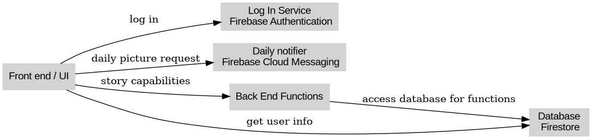
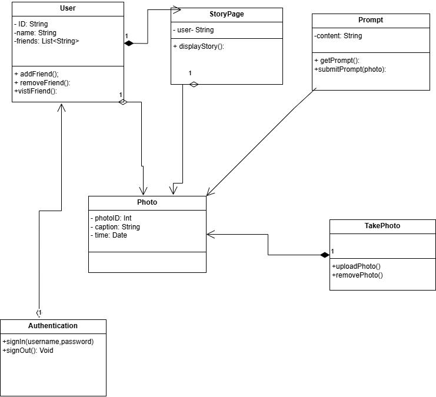
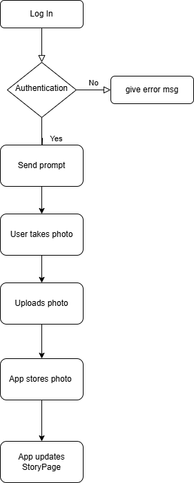
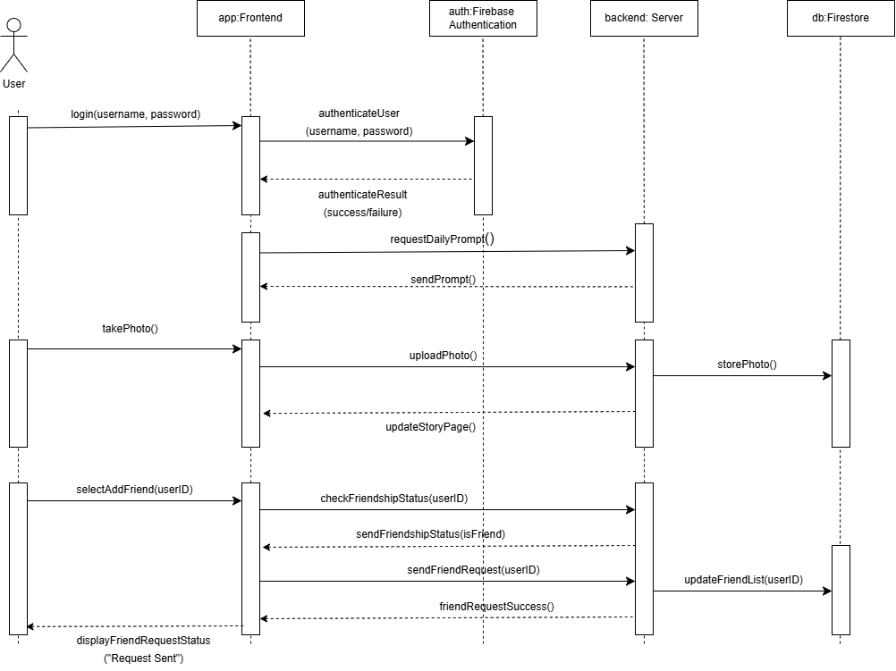

# Software Architecture, Design, and Modeling

## Software Architecture

### System Overview

TakeThat! is a social media mobile application for androids. Users will be prompted each day to take a picture within a certain criteria which will build upon there story. Users will be able to have friends to share there story with and witness theirs. Major components include the front end ( user interface), authentication service ( Firebase Authentication), database ( Firebase Cloud Firestore) and a back end for custom functions. Front end will communicate with authentication using SDK calls and once logged in will communicate with the backend services to load in user data like stories and friends. Backend will communicate with the database to provide the custom functions with the information it needs. 

### Data Storage

Flutter provides many tools and one of them is the Firebase Cloud Firestore which uses a NoSQL database system.

### Assumptions

- User will have internet access.
- Firebase services will maintain availability.
- Low amount of users to maintain small scale use

## Software Design

Will focus on the front end component since a lot of the other components such as the data base and authentication component's are built in features of the flutter tool.

### Front End Internal Structure

#### Important Classes

- User
- StoryPage
- Prompt
- Photo
- TakePhoto
- Authentication

1. User will contain information on the user and methods will include adding/ removing friends along with visiting friends pages. It will have many photo objects so is aggregated to photos. User also creates a story page using its information and collection of photos and so it composes StoryPage. Lastly User also is associated with authentication.

2. StoryPage besides its relationships with User it also contains many photo objects so is aggregated to that class.

3. Prompt is associated with photo since but has no ownership.

4. Takephoto creates a photo object so it composes that class.

5. Authentication only relationship is the previously mentioned user aggregation.

#### Design Pattern

TakeThat! follows a MVC design because we can divide our application into each of the three parts.

- Model - Our User and photo classes both simply just hold data or information that our program uses.

- View - Our StoryPage shows a collection of our data in a meaningful way to the users

- Controller - Authentication and our prompt are ways of collecting or managing our data for users.

### Behavior Modeling

 Step by step for uploading goes as follows. When the user is authenticated our prompt class will notify them of the daily prompt. User can then use the TakePhoto to capture a photo object and upload that photo. Database will be updated with that photo and then the StoryPage will be able to correctly show the us updated story.
 
 
 

 The sequence diagram illustrates the interaction between the user, frontend, backend, and Firebase services across various use cases. The diagram begins with the user logging into the app by providing their username and password, which are sent to the frontend. The frontend then communicates with FirebaseAuth to authenticate the user, returning the authentication result back to the frontend. Once logged in, the frontend sends a request to the backend server for the daily prompt, which is then retrieved and displayed to the user. Additionally, the diagram includes the process of the user taking a photo, where the frontend uploads the photo to the server, and the backend stores it in Firestore, updating the user's story page. The sequence diagram effectively demonstrates the flow of interactions and the time-based dependencies between these objects, ensuring the user experience is seamless and efficient.

 
 
 
 
 
 

 
 
 

